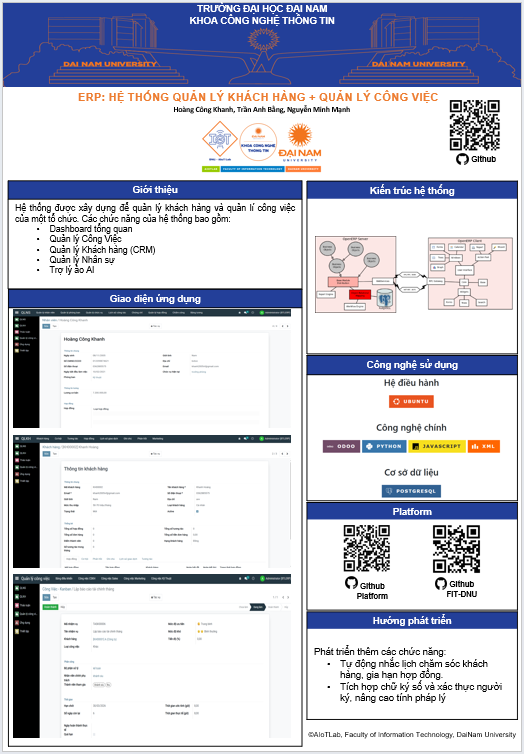
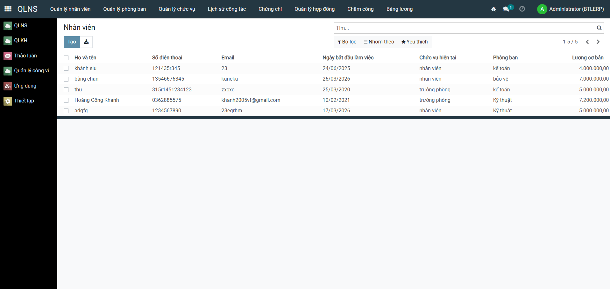
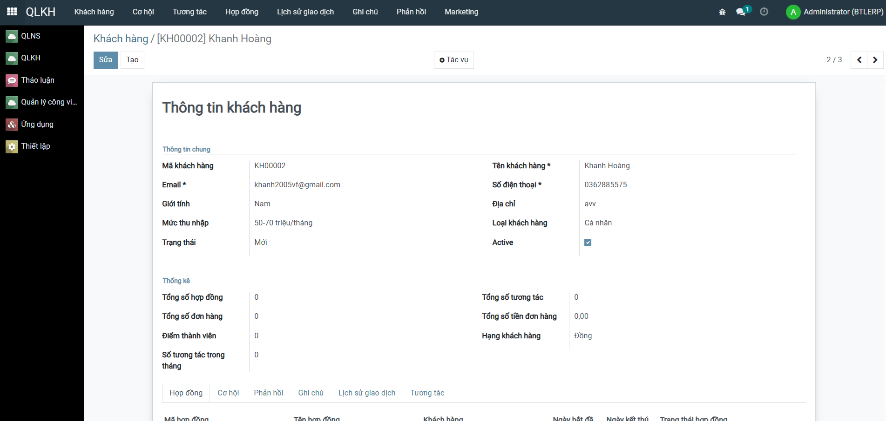
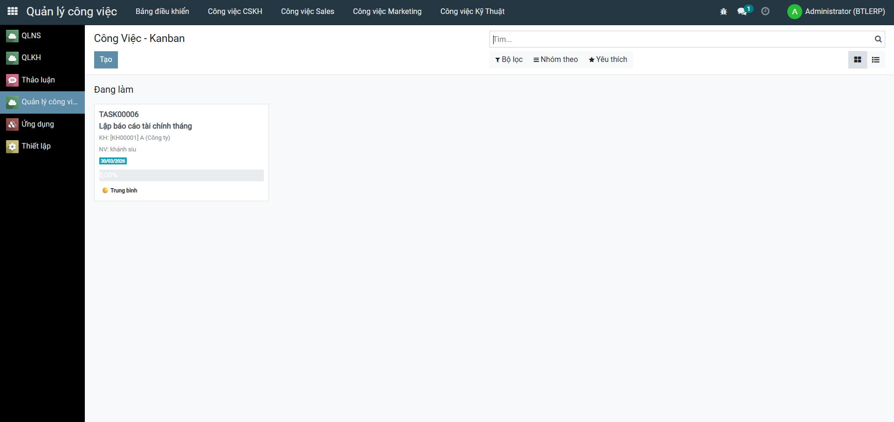

<h2 align="center">
    <a href="https://dainam.edu.vn/vi/khoa-cong-nghe-thong-tin">
    🎓 Faculty of Information Technology (DaiNam University)
    </a>
</h2>
<h2 align="center">
    Hệ Thống Quản Lý Nhân Sự, Công Việc và Khách Hàng<br/>
    <small>Human Resources, Work Management & Customer Relationship System</small>
</h2>
<div align="center">
    <p align="center">
        
        
        
    </p>

[](https://www.facebook.com/DNUAIoTLab)
[](https://dainam.edu.vn/vi/khoa-cong-nghe-thong-tin)
[](https://dainam.edu.vn)

</div>
 
## 📖 1. Giới thiệu
Hệ thống Quản lý Nhân Sự, Công Việc và Khách Hàng được xây dựng dựa trên nền tảng **Odoo**, nhằm hỗ trợ các doanh nghiệp trong việc quản lý toàn diện về nhân sự, quy trình công việc và mối quan hệ khách hàng. Hệ thống cung cấp các tính năng:

- **Quản lý Nhân Sự (HR)**: Quản lý thông tin nhân viên, hợp đồng lao động, phòng ban, chức vụ, kỹ năng và phát triển nhân sự
- **Quản lý Công Việc (Projects)**: Lên kế hoạch, phân công công việc, theo dõi tiến độ, quản lý nhiệm vụ và báo cáo hiệu suất
- **Quản lý Khách Hàng (CRM)**: Quản lý danh bạ khách hàng, cơ hội kinh doanh, bán hàng, tương tác khách hàng và phân tích dữ liệu

Thay vì sử dụng các tệp Excel rời rạc hay hệ thống thủ công, giải pháp này mang lại một nền tảng tập trung, hiện đại, tự động hóa và dễ sử dụng cho toàn bộ quy trình quản lý doanh nghiệp.

## 🖼️ 2. Poster
<div align="center">



</div>

## 🔧 3. Các công nghệ được sử dụng
<div align="center">

### Nền Tảng Chính
[](https://www.odoo.com/)
[](https://www.python.org/)

### Công nghệ Backend
[](https://www.postgresql.org/)
[](#)

### Công nghệ Frontend
[](#)
[](#)
[](#)

### Hệ điều hành


### Công cụ & Deployment
[](https://www.docker.com/)
[](https://docs.docker.com/compose/)
[](https://git-scm.com/)
</div>

## 🚀 4. Các tính năng chính

### ✨ Quản lý Nhân Sự (HR Module)
- 👥 Quản lý thông tin nhân viên chi tiết (thông tin cá nhân, liên lạc, hợp đồng)
- 🏢 Tổ chức cấu trúc công ty (phòng ban, chức vụ, quản lý cấp bậc)
- 📋 Quản lý hợp đồng lao động, tuyển dụng và onboarding nhân viên
### 💼 Quản lý Công Việc (Projects Module)
- 🧩 Tạo và quản lý dự án
- 📅 Lập kế hoạch dự án, phân công nhiệm vụ cho nhân viên
- 🎯 Theo dõi tiến độ công việc, thời hạn hoàn thành
- 👥 Phân công tài nguyên, quản lý thành viên dự án
- ⏱️ Ghi nhận thời gian làm việc, báo cáo chi phí dự án
- 📈 Báo cáo tiến độ, phân tích năng suất và hiệu quả dự án


### 👥 Quản lý Khách Hàng (CRM Module)
- 💼 Quản lý danh bạ khách hàng (công ty, liên hệ cá nhân)
- 📇 Lưu trữ thông tin liên lạc, lịch sử tương tác khách hàng
- 🎯 Quản lý cơ hội kinh doanh, bán hàng và quy trình bán hàng
- ✉️ Quản lý email, cuộc gọi, cuộc họp và sự kiện khách hàng
- 🗂️ Quản lý hoạt động, nhiệm vụ liên quan đến khách hàng

## 🖼️ 5. Giao diện chính
<div align="center">







</div>

## ⚙️ 6. Cài đặt và Chạy Hệ Thống

**Bước 1**: Cập nhật hệ thống
```bash
sudo apt update && sudo apt upgrade -y
```

**Bước 2**: Cài đặt các gói phụ thuộc
```bash
sudo apt install -y python3 python3-pip python3-dev postgresql postgresql-contrib \
    git libxml2-dev libxslt1-dev libzip-dev libsasl2-dev libssl-dev libffi-dev \
    libjpeg-dev zlib1g-dev
```

**Bước 3**: Clone project
```bash
git clone https://github.com/khanh2005vf/khanh2005vf
cd CNTT-17-11-N13
```

**Bước 4**: Tạo virtual environment
```bash
python3 -m venv venv
source venv/bin/activate
```

**Bước 5**: Cài đặt các dependency
```bash
pip install --upgrade pip
pip install -r requirements.txt
```

**Bước 6**: Cấu hình database PostgreSQL
```bash
sudo -u postgres createdb odoo_db
sudo -u postgres createuser -P odoo_user
# Nhập mật khẩu khi được yêu cầu
```

**Bước 7**: Chỉnh sửa file cấu hình
```bash
cp odoo.conf.template odoo.conf
# Sửa file odoo.conf:
# - db_name = odoo_db
# - db_user = odoo_user
# - db_password = <password>
```

**Bước 8**: Khởi chạy Odoo
```bash
./odoo-bin -c odoo.conf
# Hoặc sử dụng Python
python3 odoo-bin.py -c odoo.conf
```

**Bước 9**: Truy cập Odoo
- Mở trình duyệt: `http://localhost:8069`

</div>
    
